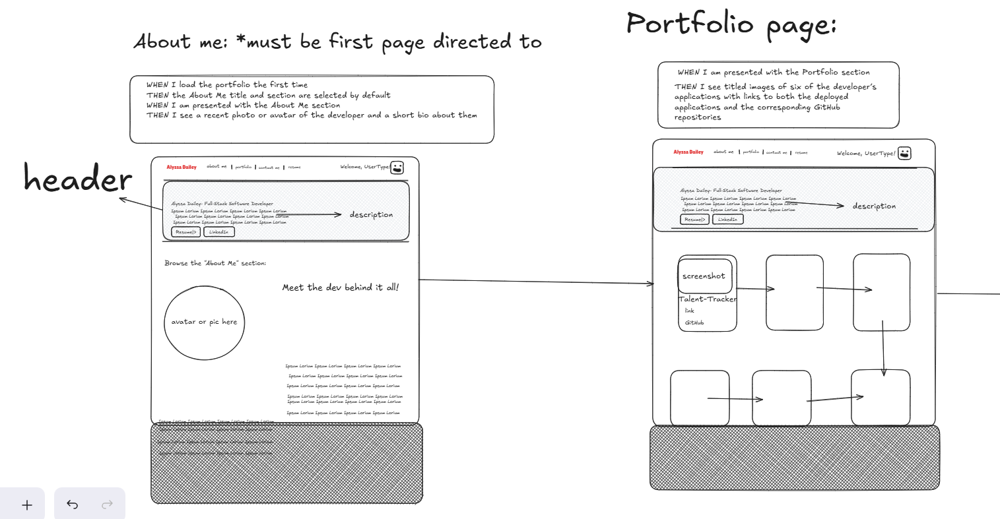
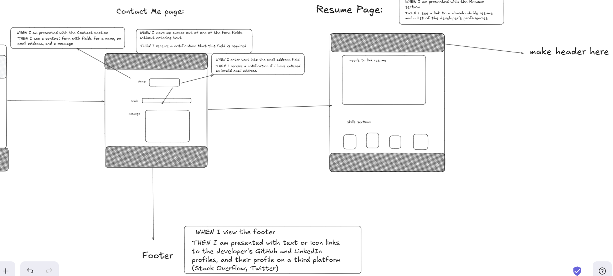
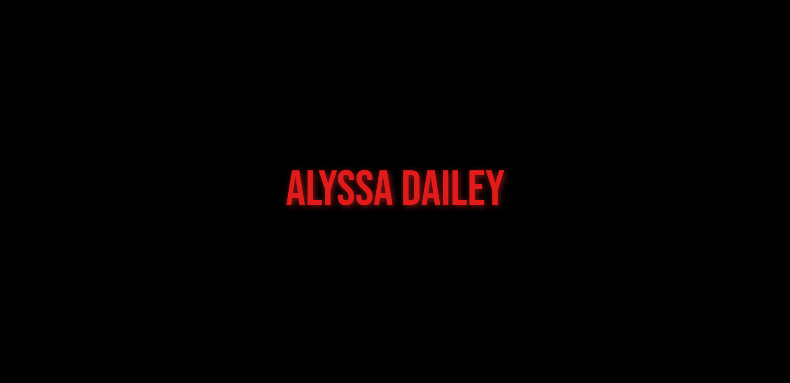
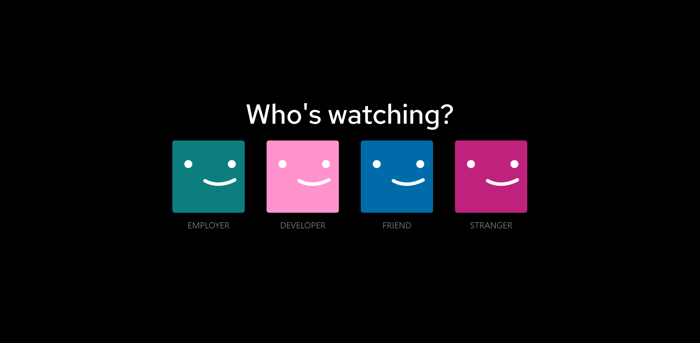
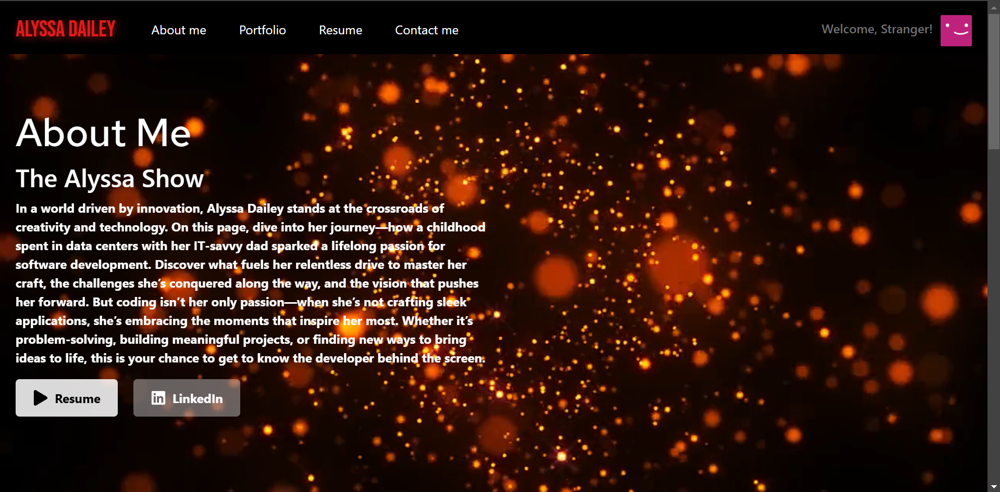
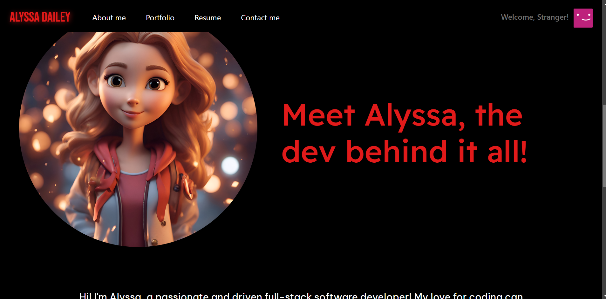
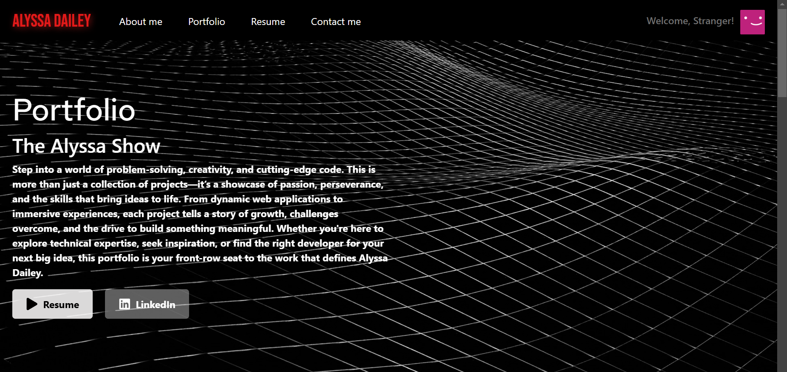
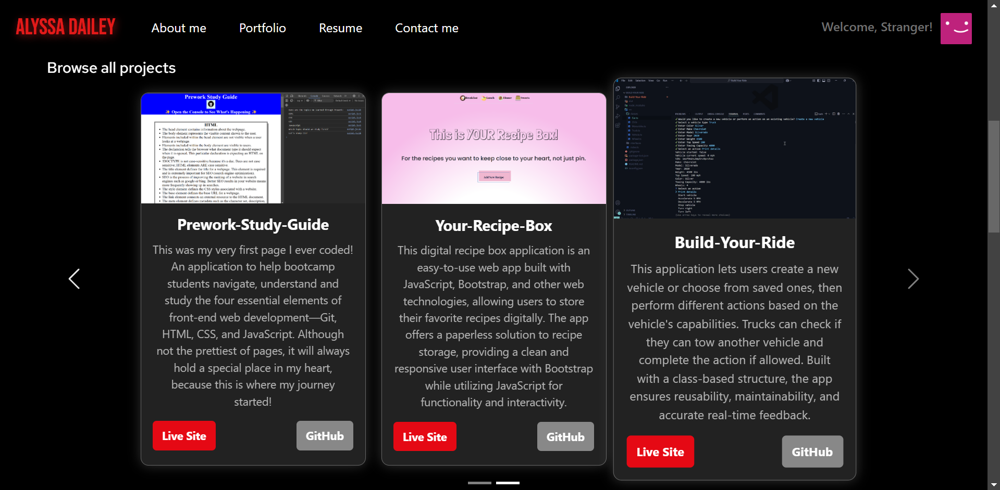
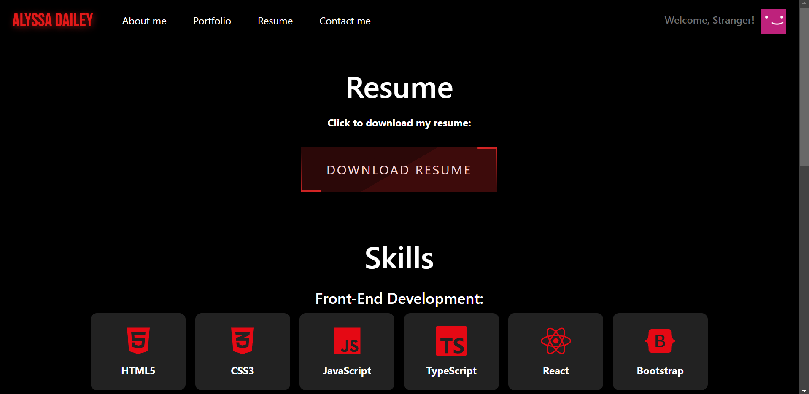
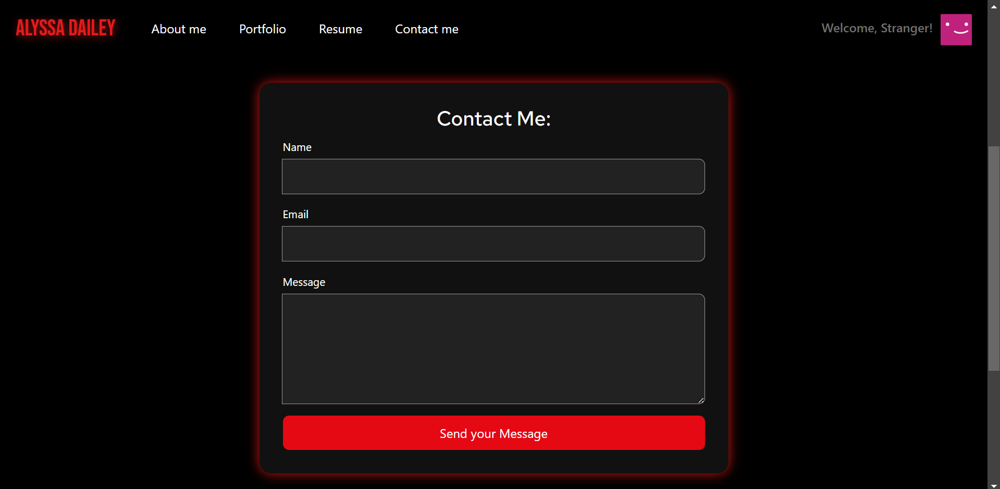

# Alyssa Dailey's Portfolio Site

## Description
Welcome to my Netflix-Inspired Portfolio Website, a dynamic and immersive way to showcase my skills, projects, and experience as a full-stack developer. This site is designed to provide an engaging, interactive experience that mirrors the sleek and familiar aesthetic of Netflix.

Built using React, Bootstrap, and reusable components, the site delivers smooth transitions, eye-catching animations, and a user-friendly interface.

This project reflects my ability to create visually stunning, interactive, and user-friendly web applications while utilizing modern web technologies. Dive in and explore my world through the lens of Netflix!

## Table of Contents (Optional)

If your README is long, add a table of contents to make it easy for users to find what they need.
- [Description](#description)
- [Installation](#installation)
- [Features](#features)
- [Usage](#usage)
- [Credits](#credits)
- [Questions](#questions)

## Installation

N/A! Just visit the live site and all features are readily available!

 ## Features

🎬 <strong>Cinematic Entry:</strong> The homepage greets visitors with my name in the iconic Netflix font. A single click anywhere on the screen triggers the signature Netflix login sound and animation, setting the stage for an immersive experience.

👤 <strong>Who’s Watching?</strong> Just like Netflix, users are then presented with a profile selection page, allowing them to choose their viewer type (e.g., Recruiter, Developer, Friend, Stranger). Each profile leads to a customized experience tailored to the selected user.

📺 <strong>Personalized Experience:</strong> Upon selection, users land on my About Me page, designed to resemble Netflix’s UI while providing insight into my background, skills, and journey as a developer. A custom navigation bar allows seamless access to other sections of the site.

🚀 <strong>Explore More:</strong> The portfolio includes sections highlighting my projects, resume, and contact form, all designed with a clean, professional look while maintaining the Netflix-inspired theme.

## Usage

The Wireframe I Created During the Design Process: 

-The first page presented to the user is the home page, which displays my name. The user will click anywhere on the page to continue to the next page.

photo reference: 

-When the user clicks, the login sound is triggered as well as added animations.
Then the user is presented with the Who's Watching page.
This page will allow users to select the type of user they are on my site.

photo reference: 

-Once the user has selected the type of user they are, they are presented with my About me page.
This page displays a navbar to allow the user to select the page they would like to view on my page.

photo reference: 

-The about me page contains content that allows the user to get to know me personally.

photo reference: 

-The portfolio page displays my projects for the user to view.

photo reference: 
 

-The resume page displays a button allowing the user to download and view my resume. 
This page also displays my skills and tools that I know and use as a developer.

photo reference:

The contact me page displays a form that allows users to send me a personalized message with their name and email.

photo reference: 

## Credits

- Page login sound: https://www.myinstants.com/en/index/us/

- Header videos: https://www.pexels.com/

- "About me" girl avatar photo: https://www.freepik.com/

- Download Resume button- https://dev.to/webdeasy/top-20-css-buttons-animations-f41  author of code: Alex Bodin

- Used Xpert Learning Assistance and ChatGPT to assist me in answering any questions I had throughout this project.

## Links

- <strong>Deployed Site:</strong> [alyssadailey.netlify.app](https://alyssadailey.netlify.app/)

- <strong>GitHub:</strong> https://github.com/alyssadailey/Portfolio-Project

## Questions

If you have any questions, please reach out to me at [alyssadailey28@gmail](mailto:alyssadailey28@gmail).

You can find more of my work at [Github.com/alyssadailey](https://github.com/Github.com/alyssadailey).

<strong>Happy Coding!👩‍💻</strong>

